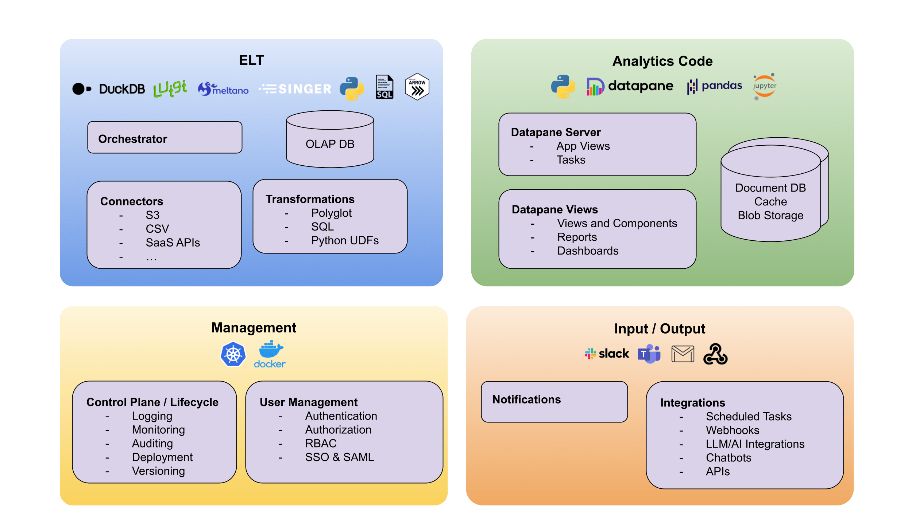

---
hide:
  - navigation
---

Tile is architected to provide all the features you need to build robust and production-ready Data Projects, essentially a _Data SDK in a box_.

Tile is built from multiple components that have been selected to work well together - we build on top of great open-source tools in the Python ecosystem, connecting them together and providing a integrated way to make use of them all.

<figure markdown>
  { loading=lazy }
  <figcaption>Tile Project Architecture</figcaption>
</figure>

## Components

Tile is split up into multiple sections comprised of several components - below we'll list a few of them and how they help you build Data Products.

## Analytics Code

Tile uses the popular [Datapane](https://github.com/datapane/datapane) Python library to provide support for building Application Servers, Reports, and Dashboards that make up your project.

You can use Datapane with many popular Python data science libraries, such as Pandas, Altair, and Matplotlib, and it works direct from Jupyter.

### Reportings and Dashboarding

Datapane provides data reporting and dashboard functionality, which allows users to create visually engaging reports and interactive dashboards. This helps you communicate insights effectively and enables stakeholders to make data-driven decisions. By providing clear visualizations and a user-friendly interface, developers can easily share their findings and monitor key performance indicators within their applications.

### Datapane Components

Datapane provides a suite of Python-based components and functions designed to perform live data analysis. Create and reuse components that allow you to process and analyze data in real-time, enabling them to uncover insights and make data-driven decisions quickly. By providing a Python-centric approach, your code can benefit from the language's extensive libraries and familiar syntax while building responsive, high-performance data-driven applications.

### Datapane Tasks

Our open-source Python project includes features for managing background and scheduled tasks, which automate updates of datasets and the execution of analytics code. These capabilities allow developers to set up routine data refreshes and run analysis tasks without manual intervention, ensuring timely insights and efficient resource usage. By automating these processes, users can concentrate on exploring data and developing valuable applications, while the system effectively handles the underlying tasks.

### App Databases

Your Data Products may need to store application-specific data independent of your analytics data, such as user preferences.

Tile provides multiple persistance options for your Data Applications, including Document Databases (like Mongo DB), persistent caches, and Blob Storage (such as S3). These can be updated automatically, or as part of scheduled tasks, for instance, to update a trained model out-of-band for use within a Data Product.

## ELT

Our ELT functionality empowers users to efficiently extract data from a wide array of sources, including databases, APIs, and file formats, ensuring seamless integration with virtually any data source. Once the data is extracted, it is loaded the projects OLAP DB for further transformation, allowing for tailored manipulation and analysis. By simplifying and automating the data ingestion process, Tile saves valuable time and resources, enabling data developers to focus on building applications and uncovering insights from their data. 

### Orchestration

Easily build, run, and orchestrate data pipelines - allowing you to efficiently manage, schedule, and monitor multiple data processing tasks, ensuring that dependencies are met and errors are handled gracefully. By automating and centralizing pipeline management, Tile projects eliminates manual intervention, reduces operational overhead, and accelerates uncovering insights. 

### Transformations

Make use of SQL and Python data transformations in your Tile project, enabling developers to harness the power of familiar query languages and scripting. This support allows for seamless manipulation and cleaning of data, catering to a wide range of analytical requirements. Benefit from the flexibility of both SQL and Python, and supercharge your data-driven applications with efficient, adaptable data transformations.

### Connections

Tile comes with built-in support for Singer Taps and Meltano integrations, enabling seamless data connections withing your applications. Effortlessly connect to numerous data sources and benefit from streamlined data extraction, ensuring compatibility and adaptability for your data-driven applications. Capitalize on the convenience of reliable data connections and elevate your data workflows with our versatile integration options.

### OLAP Database

We use [DuckDB](https://duckdb.org/) as our OLAP (Online Analytical Processing) database - DuckDB provides efficient, multidimensional data analysis, making it easier to explore and manipulate large datasets in real-time. By integrating DuckDB, you can easily use both SQL and Python to rapidly work with large datasets, transform them and persist them trivially within your applications.

## Input / Output

### Notifications

Tile offers support for popular communication channels like Slack, Teams, and Email. Use notifications to help users stay informed about the progress and status of their data-driven applications, as well as send timely alerts for critical events, errors, or triggers. By integrating these notification options, developers can ensure effective communication, improved collaboration, and prompt issue resolution within their teams.

### Integrations

Tile comes with integrations built-in to work with external products, such as SaaS APIs, via webhooks. Python tasks can be scheduled to run in the background to perform batch processing.

We also provide integrations into multiple LLMs via [LangChain](https://python.langchain.com/) enabling the automated analysis of data.

## Management

### User Management

Tile comes with user management out of the box, so you can efficiently handle permissions, Role-Based Access Control (RBAC), and SAML-based single sign-on. This functionality allows you to define and manage access levels for different users, ensuring data security and compliance within your application. By providing granular control over user access, developers can build Data Projects effectively while safeguarding sensitive information and maintaining a secure environment.

### Admin

Tile provide essential tools for logging, monitoring, deployment, and versioning. These capabilities enable developers and admins to maintain robust applications by tracking system activity, monitoring performance, managing deployments, and handling version control. By offering comprehensive administrative support, Tile ensures that users can effectively manage and optimize their applications.
