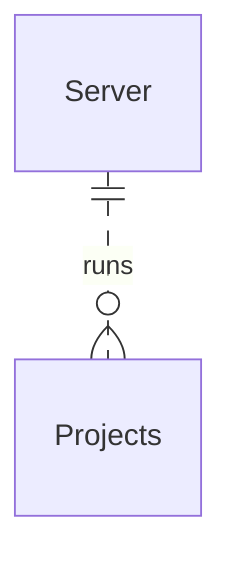

# Overview

Tile is designed to be a high-level system and format that comprises all the components that make up a [Tile project](../architecture.md).

As a product, Tile is split into two main systems, [Tile Projects](./projects.md) and the [Tile Server](./server.md). You can build multiple Tile projects, such as a Marketing Analytics Application, and deploy them to your Tile Server, where admins can manage the project, configure it, and more.

