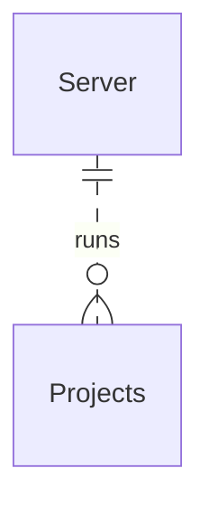

# Overview

Tile is designed to be a high-level system and format that comprised all the components that make up a [Tilre project](../architecture.md).

Tile is comprised to two main sections, the [Tile Server](./server.md) and [Tile Projects](./projects.md). You can build multiple Tile projects, such as a Marketing Analytics Application, and deploy them to your Tile Server, where admins can manage the project, configuring, and more.

