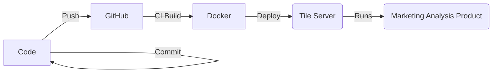

Tile projects has a common structure and lifecycle that drastically simlplficies building and maintaining Tile Data Products. In this section we'll go thourgh these steps:



## Code Development

As described [previously](./projects.md), it's easy to configure and build your Tile project.

You can test most of your project locally during development, including using Datapanes inline Jupyter support.

We recommend you build most of your Python code as functoins, taht you can easily mock and test during development to check that they are working as intended.

Tile also supports building a mock version of your system for running locally via Docker, so you can test how your product operates as a whole when working with it locally. To do this, simply run,

```bash
$ tile debug
```

## Building and Deployment


### Server Configuration

To deploy your project, you first need to configure your Tile Server, this can be done by running the follwing from the commandline

```bash
$ tile setup --server ${SERVER} --token {$TOKEN}
```

where `$SERVER` and `$TOKEN` are values taking from the Tile Server management console.

### Buliding

Tile projects are built as a collection of networked and codependent container images that represent your entire project, from the Application code, to tasks, and ELT pipelines. The resuling images are pushed to Tile Server which runs them via our customeosied and robust continuer runtime system.

### Deployment

To deploy your tile project, you can run the following from your project directory

```bash
$ tile deploy [--config config.py]
```

This will build and deploy your tile project to the Tile Server. From there you can configure it further and access it via the Tile Server interface.

!!! note
    Deployment requires Docker to be installed, even on Windows and Mac. We generally recommend using the GitOps flow instead to reduce requirements and enable a collaborative workflow

### Version Control and CI

Tile used a _GitOps_ workflow, where every Tile Project is intended to be commited and versioned via `git`.

Upon pushing your changes upstream, we recommend setting up a CI flow, for instance via GitHub Actions, that automate testing your proejct and deploying it automatically. We have built a pre-ready GitHub Action that you can use directly within your pipelines to ease this process.

You can configure the pipeline to deploy upon your own requirements, for isntance upon a git tag or when pushing to a specific branch. The commit hash is used as a unique version of your tile project that is used to version it upon deployment.

The advantage of a GitOps flow is that you have a reproducible, audited and collaboroitate process to handle Tile deployments that is independent of your local developer environment.

## Updates

When using a Git-based flow, updating your tile project becomes very easy. Simplly make your changes, commit and push to your upstream repo, triggering your automated deployment as needed.

This results in a new version of the produjct being dbuilt and deplyoed to your Tile Server.

### Migrations

As part of updating your code, you may need to run migration scripts to ensure that preivously stgored data is updated to work with the new analytics code.

Tile supports migrations that can be run as part of a new deployment - these can be specified within the `config.py` and are run by the Server as needed.
