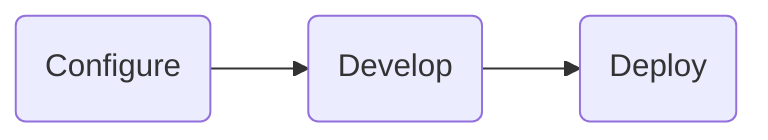

Developing a [Tile project](../architecture.md) is super simple, and there are several [reference projects and templates](../templates.md) freely available on GitHub that you can use to get started with. 
By default a Tile project includes everything needed to build, run, and deploy an internal Data Project.


## Workflow

The steps invovled in building a Tile project include,



1. Configuring the Tile project
1. Developing the Python application and workflow functions
1. Deploying your Tile project


## Configuration

Tile opts for convention over configuration, and projects can be easily defined and follow sensible defaults.

Tile projects are defined within a directory and are configured via two complementary methods,
- The filesystem layout
- the `config.py` Python-based Tile project configuration

Each directory represents a tile project, that we recommend forms it's own git repository, and from there can be deployed to a Tile Server (see [lifecycle](./lifecycle.md)).

### Directory Layout

Tile projects follow a known filesystem layout, to make jumping between projects much simpler. The layout below describes that basic layout of a Tile Project, including the configuration and all python code and data used for the solution.

```bash
my-tile-project/
│  # tile configuration
├─ config.py
│  # datapane server views and tasks
├─ app.py | app.ipynb
├─ tasks.py
│  # supporting python modules
├─ a.py
├─ b/
│  └─ c.py
│  # persistent data within the /data dir
├─ data/
│  ├─ model.pkl
│  └─ users.db
│  # python packages
├─ requirements.txt
├─ .gitignore
└─ README.md
```

### Configuration File

Tile projects are configured via a single Python script called `config.py`. 

We use python even for configuration, over formats like `yaml`, as we cna make use of standard Python constructs to make the configuration more readable.

The Tile configuration is a single Python object that describes the Tile Project, this is comprised from multiple containing objects that describes how each subsystem works.

An example `config.py` is as below:

```python
from tile.package import Package

package = Package(
  entrypoint = "app.py",
  data_dir = "data/",
  autodiscover = True,
  databases = [
     DuckDBConnector(),
  ],
  # package file configuration
  include = ["a.py", "b/"],
  exclude = [],
  # scheduled tasks
	schedules = [
	   Task(name="daily-report", cron="00 9 * * MON-FRI"),
	],
  # notification configuration, e.g. Slack, Email. Teams
  notifications = [
    Email(smtp_config = ""),
    Slack(slack_api_key = ""),
  ],
  env_vars = {},

  # ELT workflows
  workflows = [
    Workflow(name="Load HR Info", cron="00 1 * * *", 
             source="Workflow", on_load="transform-hr-info")
  ]
)

# package lifecycle hooks
def first_run():
  # code to run upon installing the package
  ...
```


## Project Development

You can develop your Tile project using all of the included components - we provide Python-based interfaces and wrappers around all of them for easy use within your code.

You can write all your your Data Application code and tasks using [Datapane](https://github.com/datapane/datapane)'s View framework - Tile will look for a Datapane Application within `app.py` and use it (Datapane also has great notebook support so will also look for notebooks called `app.ipynb`). You can find more from the [Datapane Application docs](https://docs.datapane.com).

Tile also builds upon several other components that you can use from your Python code, you can find their documentation on their specific pages, including

- [DuckDB](https://duckdb.org/docs/){target=_blank}
- [Meltano Connectors](https://hub.meltano.com/){target=_blank}
- [Luigi](https://luigi.readthedocs.io/){target=_blank}

Tile projects can be developed locally or using remote development platforms such as GitHub Codespaces, in addition we support all Notebook environments, including JupyterLab, VSCode Notebooks, and more.


## Deployment

Tile projects can be easily deployed to a Tile server, either directly from the project file, or via a CI-based mechanism such as GitHub Actions. We generally recommend the latter approach when building more robust systems however the former is useful when first getting started.

Deployment is part of the Tile Project lifecycle covered in the [next section](./lifecycle.md).
