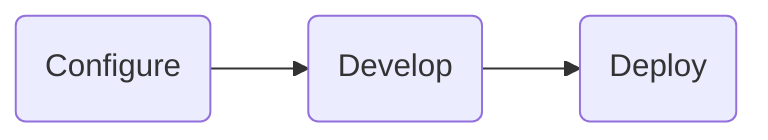

Developing a [Tile project](../architecture.md) is super simple, and there are several [reference projects and templates](../templates.md) freely available on GitHub that you can use to get started with. 
By default a Tile project includes everything needed to build, run, and deploy a fully-featured internal Data Project.

## Workflow

The steps involved in building a Tile project include,



1. Configuring the Tile project
1. Developing the Python application and workflow functions
1. Deploying your Tile project


## Configuration

Tile opts for convention over configuration, and projects can be easily defined and follow sensible defaults.

Tile projects are defined within a directory and are configured via two complementary methods,
- The filesystem layout
- the `config.py` Python-based Tile project configuration

Each directory represents a Tile project - we recommend the project directory forms a `git` repository, which can then be deployed to a [Tile Server](./server.md) (see [lifecycle](./lifecycle.md)).

### Directory Layout

Tile projects follow a known filesystem layout, to make switching between projects much simpler. The layout below describes that basic layout of a Tile Project, including the configuration and all python code and data used for the solution.

```bash
my-tile-project/
│  # tile configuration
├─ config.py
│  # datapane server views and tasks
├─ app.py | app.ipynb
├─ tasks.py
│  # supporting python modules
├─ a.py
├─ b/
│  └─ c.py
│  # persistent data within the /data dir
├─ data/
│  ├─ model.pkl
│  └─ users.db
│  # python packages
├─ requirements.txt
├─ .gitignore
└─ README.md
```

### Configuration File

Tile projects are configured via a single Python script called `config.py`. 

We use Python for configuration over formats like `yaml`, to make use of standard Python constructs resulting in a more readable configuration.

The Tile configuration is a single Python object that describes the Tile Project, this is composed from multiple containing objects that describes how each subsystem works.

An example `config.py` is as follows:

```python
from tile.package import Package

package = Package(
  entrypoint = "app.py",
  data_dir = "data/",
  autodiscover = True,
  databases = [
     DuckDBConnector(),
  ],
  # package file configuration
  include = ["a.py", "b/"],
  exclude = [],
  # scheduled tasks
	schedules = [
	   Task(name="daily-report", cron="00 9 * * MON-FRI"),
	],
  # notification configuration, e.g. Slack, Email. Teams
  notifications = [
    Email(smtp_config = ""),
    Slack(slack_api_key = ""),
  ],
  env_vars = {},

  # ELT workflows
  workflows = [
    Workflow(name="Load HR Info", cron="00 1 * * *", 
             source="Workflow", on_load="transform-hr-info")
  ]
)

# package lifecycle hooks
def first_run():
  # code to run upon installing the package
  ...
```


## Project Development

Tile projects are comprised of multiple open-source components, such as integrations, notifications, etc. - we provide Python-based interfaces and wrappers around all of them for easy use within your code.

The [Datapane](https://github.com/datapane/datapane) View framework is used to write all your Data Application code and tasks - Tile will look for a Datapane Application called `app.py` and automatically use it (Datapane also has great notebook support so Tile will also look for notebooks called `app.ipynb`). You can find more information about working with Datapane from the [docs](https://docs.datapane.com).

Tile Projects also build upon several other core components, including:

- [DuckDB](https://duckdb.org/docs/){target=_blank}
- [Meltano Connectors](https://hub.meltano.com/){target=_blank}
- [Luigi](https://luigi.readthedocs.io/){target=_blank}

Tile projects can be developed locally or using remote development platforms such as GitHub Codespaces, in addition we support all common Notebook environments, including JupyterLab, VSCode Notebooks, and more.

## Deployment

Tile projects can be easily deployed to a Tile server, either directly from the project file, or via a CI-based mechanism such as GitHub Actions. We generally recommend the latter approach when building more robust systems however the former is useful when first getting started.

Deployment forms part of the Tile Project [lifecycle](./lifecycle.md).
