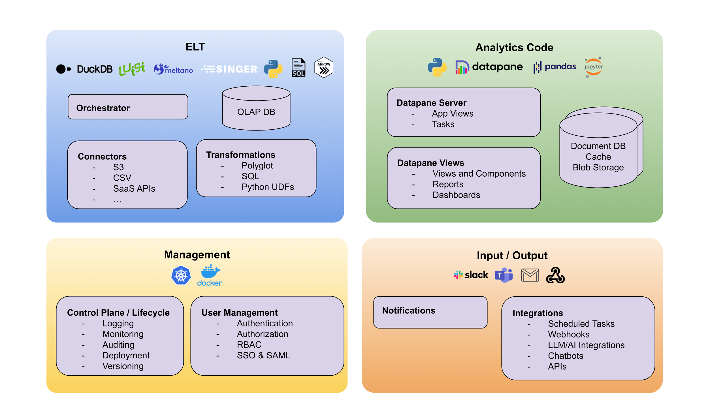
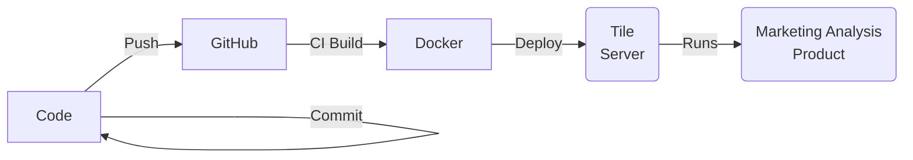

Tile is an open-source Python toolkit designed to help developers build, deploy, and run full-stack data applications with ease. It offers a complete _data-stack in a box_, including features for ELT (Extract, Load, Transform), application servers, task running, integrations, and notifications. Tile simplifies the data application development process by handling underlying complexities, allowing developers to focus on creating robust data-driven solutions. Get started with Tile and develop scalable, efficient, and maintainable data applications.

## Architecture

Tile is comprised of multiple new and existing open-source components that are carefully chosen to work together to provide a highly functionality toolkit for building data products. See [Architecture](./architecture.md) for more information.

<figure markdown>
  { loading=lazy }
  <figcaption>Tile Project Architecture</figcaption>
</figure>

## Process

Tile is more than just a framework, handling the entire development lifecycle, including the deployment and running of Tile Apps.

We provide a code-first approach that builds upon many best practices from the DevOps world, including the use of CI and containers. User applications are run as isolated instances on our custom single-tenant Tile OS running the Tile Server. This easily allows you to build and deploy multiple packages all running on the same, high-performance server and accessible by all your users.

## Why use it

Tile enables developers to build production-ready data applications efficiently. By handling the underlying complexities and providing a robust set of tools, Tile streamlines the development process and reduces the time and effort required to create reliable, high-performance applications.

Data applications are essential for sharing insights with stakeholders. They allow for the effective communication of complex data-driven findings through visualizations, dashboards, and reports. Tile simplifies this process by offering built-in integrations and APIs for creating these data visualizations, making it easier for developers to present valuable insights in an interactive manner to decision-makers.

Tile facilitates the development and management of internal and custom data-driven processes. Developers can create tailored solutions that automate data extraction, transformation, and analysis, resulting in more efficient workflows and better-informed decision-making. By using Tile, developers can focus on solving specific business problems with data-driven applications that are designed to meet their unique needs.

## Benefits

Tile offers numerous benefits to developers, making it an excellent choice for data application development. Some of these advantages include:

Data application development: Tile simplifies the process of building, deploying, and running full-stack data applications, allowing developers to create powerful solutions with less effort.

ELT (Extract, Load, Transform): Tile provides built-in support for ELT processes, enabling developers to efficiently handle data extraction, loading, and transformation within their applications.

Notifications: With Tile's notification system, developers can easily set up alerts and keep stakeholders informed about important events and updates related to their data applications.

Integrations: Tile offers a range of pre-built integrations, allowing developers to seamlessly connect their data applications with other services and tools, enhancing their functionality and enabling data-driven decision-making across platforms.

Analytics database: Tile includes support for analytics databases, enabling developers to store, query, and analyze large volumes of data efficiently within their applications.

Background and scheduled tasks: Tile simplifies the management of background and scheduled tasks, allowing developers to automate processes and run data-driven tasks at specific intervals or in response to specific events.

By leveraging these features, developers can create scalable, efficient, and maintainable data applications that meet their unique needs and drive business growth.

## Community

**GitHub**
Our centre of gravity is our GitHub where we build in the open. Come and get involved!

**Forums**
We host the Data Developer forum for all things to do with building data apps and frontends. Come and say hi!

**Twitter**
For updates, make sure to follow the Tile project on Twitter.
